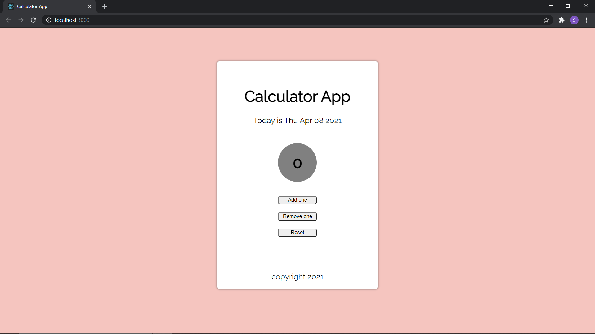

# Counter app

This is one of the first school tasks I have made with React. This is a counter app, where you can increase or decrease a number by 1. App recognizes and indicates if the number is odd or even. 

## Technologies used

Built with React

## Screenshot

